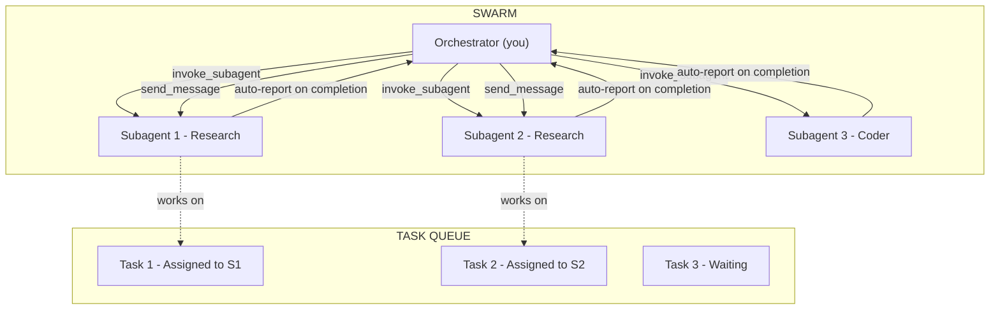

# Jetski Swarm Orchestration

Master multi-agent orchestration using Jetski's subagent tools: `define_subagent`, `invoke_subagent`, and `send_message`.

---

## Primitives

| Primitive | What It Is | Jetski Tool |
|-----------|-----------|-------------|
| **Agent** | An AI instance with tools. You are the orchestrator agent. | You (the main agent) |
| **Subagent** | A specialized agent you spawn for a focused task. Has its own conversation context. | `invoke_subagent` |
| **Subagent Type** | A reusable agent template with a system prompt and tool configuration. | `define_subagent` |
| **Message** | A text message sent between agents via conversation IDs. | `send_message` |
| **Conversation ID** | Unique identifier for each subagent instance. Returned by `invoke_subagent`. | Auto-generated |
| **Workspace** | File access mode: `inherit` (shared) or `branch` (isolated worktree). | `invoke_subagent` `Workspace` param |

### How They Connect



---

## Core Tools

### 1. `define_subagent` — Create a Reusable Agent Type

Define a specialized subagent with a custom system prompt and tool configuration:

```
define_subagent(
  name: "researcher",
  description: "Read-only research agent for codebase analysis",
  system_prompt: "You are a research specialist. Analyze code, read files, and report findings. Do not modify any files.",
  enable_write_tools: false,    // read-only
  enable_subagent_tools: false  // no sub-subagents
)
```

```
define_subagent(
  name: "coder",
  description: "Implementation agent that can read and write files",
  system_prompt: "You are an implementation specialist. Write clean TypeScript code following the project conventions in GEMINI.md.",
  enable_write_tools: true,     // can create/edit files and run commands
  enable_subagent_tools: false
)
```

### 2. `invoke_subagent` — Launch Subagents

Launch one or more subagents. They run concurrently and report back when done:

```
invoke_subagent(
  Subagents: [
    {
      TypeName: "researcher",
      Role: "Strava API Researcher",
      Prompt: "Research the Strava API rate limits and document...",
      Workspace: "inherit"  // or "branch" for isolation
    },
    {
      TypeName: "researcher",
      Role: "Supabase Schema Analyst",
      Prompt: "Analyze the current database schema in supabase/migrations/...",
      Workspace: "inherit"
    }
  ]
)
```

### 3. `send_message` — Communicate with Running Subagents

Send instructions or follow-ups to a running subagent:

```
send_message(
  Recipient: "<conversation-id>",
  Message: "Also check the rate-limiter.ts file for existing throttling logic."
)
```

### 4. `manage_subagents` — Monitor and Control

- `list` — See all active subagents and their status
- `kill` — Terminate specific subagents
- `kill_all` — Terminate all subagents

---

## Built-in Subagent Types

These are always available without `define_subagent`:

| Type | Tools | Use Case |
|------|-------|----------|
| `self` | Full (read + write + subagents) | Heavyweight tasks that need the same capabilities as you |
| `research-google` | Read-only + Google search | Research tasks that need codebase reading |

---

## Orchestration Patterns

### Pattern 1: Parallel Research (Scout Phase)

Best for gathering information from multiple areas simultaneously.

```
// Define a lightweight reader
define_subagent(
  name: "scout",
  description: "Focused research agent",
  system_prompt: "You are a research scout. Read the specified files and areas, then report a structured summary of your findings. Be thorough but concise.",
  enable_write_tools: false
)

// Launch scouts in parallel
invoke_subagent(Subagents: [
  { TypeName: "scout", Role: "Route Classifier Analyst",
    Prompt: "Read app/lib/route-classifier.ts and app/lib/constants.ts. Document: 1) How routes are classified 2) All gateway checkpoints 3) The confidence scoring system 4) Any edge cases or TODOs" },
  { TypeName: "scout", Role: "Auth Flow Analyst",
    Prompt: "Read app/server/auth.ts and app/lib/strava-oauth.ts. Document: 1) The full OAuth flow 2) Token storage strategy 3) Session management 4) Error handling gaps" },
  { TypeName: "scout", Role: "Database Schema Analyst",
    Prompt: "Read all files in supabase/migrations/. Document: 1) All tables and their relationships 2) RLS policies 3) Views and materialized views 4) Indexes" }
])
```

### Pattern 2: Pipeline (Sequential Phases)

Best for tasks with dependencies: research → plan → implement → review.

```
// Phase 1: Research (parallel)
invoke_subagent(Subagents: [
  { TypeName: "scout", Role: "Research Agent A", Prompt: "..." },
  { TypeName: "scout", Role: "Research Agent B", Prompt: "..." }
])

// Wait for both to complete (system auto-notifies you)
// Then synthesize findings and proceed to Phase 2

// Phase 2: Implementation (after research is done)
invoke_subagent(Subagents: [
  { TypeName: "self", Role: "Feature Implementer",
    Prompt: "Based on the research findings: [paste findings]. Implement the feature by..." }
])
```

### Pattern 3: Specialist Team

Best for complex features that touch multiple domains.

```
// Define specialists
define_subagent(name: "db-specialist", ...)
define_subagent(name: "api-specialist", ...)
define_subagent(name: "ui-specialist", ...)

// Launch with branched workspaces to avoid conflicts
invoke_subagent(Subagents: [
  { TypeName: "db-specialist", Role: "Database Engineer",
    Prompt: "Create the migration for...", Workspace: "branch" },
  { TypeName: "api-specialist", Role: "API Engineer",
    Prompt: "Create the server functions for...", Workspace: "branch" },
  { TypeName: "ui-specialist", Role: "Frontend Engineer",
    Prompt: "Create the React components for...", Workspace: "branch" }
])
```

### Pattern 4: Review Swarm

Best for comprehensive code review across multiple files.

```
invoke_subagent(Subagents: [
  { TypeName: "scout", Role: "TypeScript Reviewer",
    Prompt: "Review these files for TypeScript issues: [files]. Check for: type safety, proper error handling, no `any` types, correct use of `as const`. Report findings in 🔴/🟡/🟢 format." },
  { TypeName: "scout", Role: "Security Reviewer",
    Prompt: "Review these files for security issues: [files]. Check for: exposed secrets, missing input validation, RLS bypass, XSS vectors. Report findings in 🔴/🟡/🟢 format." },
  { TypeName: "scout", Role: "Architecture Reviewer",
    Prompt: "Review these files for architecture issues: [files]. Check for: server/client boundary violations, correct Supabase client usage, proper use of createServerFn. Report findings in 🔴/🟡/🟢 format." }
])
```

---

## Workspace Modes

| Mode | Behavior | Use When |
|------|----------|----------|
| `inherit` | Subagent shares your filesystem. Changes are immediately visible. | Read-only tasks, or sequential writes where only one agent writes at a time |
| `branch` | Subagent gets an isolated git worktree. Changes must be merged back. | Multiple agents writing to the same codebase simultaneously |

**Rule of thumb**: Use `inherit` for research/read-only agents. Use `branch` when multiple agents need to write files concurrently.

---

## Best Practices

1. **Define before invoking.** Create specialized subagent types with focused system prompts rather than using `self` for everything. Focused agents produce better results.

2. **Parallel research, sequential implementation.** Read operations are safe to parallelize. Write operations should be sequential or use branched workspaces.

3. **Be specific in prompts.** Include exact file paths, expected output format, and completion criteria. Subagents don't inherit your conversation history.

4. **Include project context in prompts.** Tell subagents to read `GEMINI.md` and `.agent/references/sf2g-architecture.md` for project conventions.

5. **Don't poll.** The system automatically notifies you when subagents complete. Simply stop calling tools and wait.

6. **Use `manage_subagents` to monitor.** List active subagents to check status. Kill stuck agents and relaunch.

7. **Synthesize results.** After parallel research completes, synthesize the findings into a coherent plan before proceeding to implementation.

8. **Limit concurrency.** 3–5 subagents is the sweet spot. More than that increases coordination overhead without proportional speedup.

---

## Common Swarm Recipes

### Full Feature Build

```
Phase 1: Scout (3 parallel researchers)
  → Scout A: Research existing patterns in the area
  → Scout B: Research the API/data layer
  → Scout C: Research similar features for reference

Phase 2: Plan (you, the orchestrator)
  → Synthesize scout findings into an implementation plan artifact
  → Get user approval

Phase 3: Build (1-2 sequential coders)
  → Coder A: Database + server layer
  → Coder B: Client components + routes (after A completes)

Phase 4: Review (3 parallel reviewers)
  → Reviewer A: TypeScript/React quality
  → Reviewer B: Security audit
  → Reviewer C: Architecture conformance
```

### Bug Triage

```
Phase 1: Research (parallel scouts, one per bug)
  → Each scout investigates a single bug's root cause

Phase 2: Plan (you)
  → Order fixes by dependency and risk
  → Present plan for approval

Phase 3: Fix (sequential, one commit per bug)
  → Fix safest bugs first
  → Each fix type-checks before moving to the next
```
