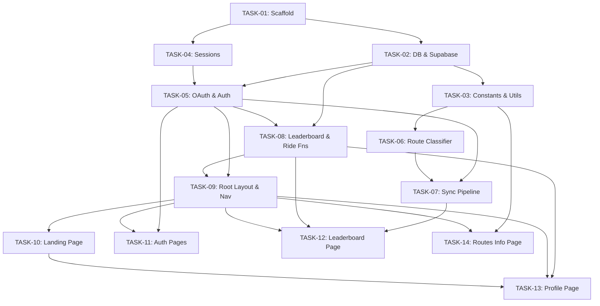

# SF2G Commute Tracker — Implementation Plan

> Planner Phase • 2026-05-25
> 13 ordered tasks for sequential Coder agent execution

---

## Overview

This plan breaks the SF2G system architecture into 13 self-contained implementation tasks. Each task is independently testable. The Coder agent should execute these **in order** — each task builds on the previous ones.

**Key constraints:**
- Package manager: `pnpm`
- Deployment: Cloudflare Pages (NOT Vercel)
- Supabase project ref: `dgoqjrfjrzewplwayhhz`
- Strava Client ID: `251048`
- Strava read rate limits: 100/15min, 1000/day
- Route classification: GPS gateway/checkpoint (NO segment IDs)
- Credentials already in `.env.local` (gitignored)

---

## TASK-01: Project Scaffold & Configuration

**Title:** Initialize TanStack Start project with all dependencies

**Description:**
Set up the TanStack Start project from scratch. Create `package.json` with all required dependencies, configure TypeScript in strict mode, set up the TanStack Start app config with **Cloudflare Pages preset**, and create all entry point files (`client.tsx`, `router.tsx`, `ssr.tsx`). Also create `wrangler.toml`, `.env.example`, `.gitignore`, and the folder structure.

**Files to Create:**
- `package.json`
- `tsconfig.json`
- `vite.config.ts`
- `app/client.tsx`
- `app/router.tsx`
- `app/ssr.tsx`
- `app/routeTree.gen.ts` (placeholder — auto-generated by TanStack Start)
- `.env.example` (update existing with all vars)
- `.gitignore` (update existing)
- `wrangler.toml` (Cloudflare Pages config with nodejs_compat)
- `public/favicon.ico` (placeholder)

**Dependencies:** None (first task)

**Inputs:**
- Package dependencies from architecture §2.3:
  ```
  dependencies: @supabase/supabase-js ^2.45.0, @tanstack/react-query ^5.60.0,
  @tanstack/react-router ^1.80.0, @tanstack/react-start ^1.80.0,
  @tanstack/react-table ^8.20.0, @tanstack/react-virtual ^3.10.0,
  react ^19.0.0, react-dom ^19.0.0, recharts ^2.15.0, @mapbox/polyline ^2.0.0
  devDependencies: @types/react ^19.0.0, @types/react-dom ^19.0.0,
  typescript ^5.7.0, supabase ^1.200.0
  ```
- TanStack Start config: `vite.config.ts` with Vite plugin from `@tanstack/react-start/plugin/vite`
- TypeScript: strict mode enabled
- Scripts: `dev`, `build`, `preview`, `deploy`, `typecheck`, `db:types`

**Acceptance Criteria:**
- [ ] `pnpm install` succeeds with no errors
- [ ] `pnpm typecheck` passes (no type errors on empty project)
- [ ] `pnpm dev` starts the dev server without crashing
- [ ] All folders exist: `app/routes/`, `app/components/`, `app/lib/`, `app/server/`, `app/queries/`, `app/styles/`, `supabase/migrations/`, `public/`
- [ ] `.env.example` contains all 7 environment variables

**Estimated Complexity:** S

---

## TASK-02: Database Schema & Supabase Client

**Title:** Create database migration and Supabase client setup

**Description:**
Create the complete SQL migration file with all tables, views, indexes, RLS policies, and helper functions. Set up the Supabase client factory module with both anon and service role clients. Create a hand-written `database.types.ts` file with types matching the schema (since we can't run `supabase gen types` in the agent environment).

**Files to Create:**
- `supabase/migrations/001_initial_schema.sql`
- `app/lib/supabase.ts`
- `app/lib/database.types.ts`

**Dependencies:** TASK-01

**Inputs:**
- Complete SQL schema from architecture §3.1 — includes:
  - `users` table (UUID pk, strava_id, tokens, sync metadata, generated display_name)
  - `rides` table (UUID pk, user_id FK, strava_activity_id UNIQUE, classification fields, metrics, GPS data)
  - `leaderboard_view` materialized view (aggregated stats per user)
  - `monthly_ride_stats` regular view
  - RLS policies: public reads, deny anon writes
  - `refresh_leaderboard()` function
  - `update_updated_at_column()` trigger
- Supabase client from architecture §5.2:
  - `createAnonClient()` — uses `SUPABASE_URL` + `SUPABASE_ANON_KEY`
  - `createServiceClient()` — uses `SUPABASE_URL` + `SUPABASE_SERVICE_ROLE_KEY`
  - Both typed with `Database` generic
- Type exports: `User`, `UserInsert`, `Ride`, `RideInsert`, `LeaderboardEntry`, `MonthlyRideStat`

**Acceptance Criteria:**
- [ ] Migration SQL is syntactically valid PostgreSQL
- [ ] Migration can be applied via `supabase db push` or SQL editor (manual verification)
- [ ] `createAnonClient()` and `createServiceClient()` return typed Supabase clients
- [ ] `database.types.ts` exports `Database`, `User`, `UserInsert`, `Ride`, `RideInsert`, `LeaderboardEntry`
- [ ] `pnpm typecheck` passes with the new files
- [ ] All column names and types in `database.types.ts` match the SQL migration exactly

**Estimated Complexity:** M

---

## TASK-03: Constants & Utility Libraries

**Title:** Create shared constants, polyline decoder, and rate limiter

**Description:**
Build the utility modules that other tasks depend on. This includes: (1) app-wide constants with route gateway definitions, Strava config, and route colors; (2) polyline decode utility for GPS coordinate extraction; (3) rate limiter for Strava API calls tracking 15-min and daily windows.

**Files to Create:**
- `app/lib/constants.ts`
- `app/lib/polyline.ts`
- `app/lib/rate-limiter.ts`

**Dependencies:** TASK-02 (needs `RouteCategory` type)

**Inputs:**
- Gateway definitions from architecture §7.5 — 8 **user-verified** gateways across 4 corridors:
  - HMBW: South/HMB (37.4487, -122.4292), North/Devil's Slide (37.5780, -122.5124)
  - Skyline: North/Daly City (37.6684, -122.4852), South/Kings Mtn (37.4839, -122.3158)
  - Bayway: North/SFO (37.6840, -122.3900), South/Foster City (37.5792, -122.3107)
  - Royale: North/Colma (37.6253, -122.4143), South/San Carlos (37.5210, -122.2767)
- `GATEWAY_RADIUS_METERS = 500`
- Known landmarks for future features (from architecture §7.5):
  - `PPR_COORDS`: Peet's Coffee at Park Presidio (37.7734, -122.4389) — classic SF2G departure
  - `KNOWN_INTERCEPTS`: JD/Skyline (37.6984, -122.4950) — where riders join mid-route
- Rate limiter from architecture §5.3:
  - Read limits: `LIMIT_15MIN = 100`, `LIMIT_DAILY = 1000`
  - `SAFETY_MARGIN = 0.85`
  - Exports: `isApproachingLimit(headers)`, `fetchWithRateLimit(url, accessToken, maxRetries)`
- Polyline: decode Google encoded polyline → `[lat, lng][]` array
  - Can use `@mapbox/polyline` package or implement from scratch
- Constants also include route color mappings and Strava API base URLs

**Acceptance Criteria:**
- [ ] `ROUTE_GATEWAYS` array contains all 8 gateway objects with correct coordinates
- [ ] `PPR_COORDS` and `KNOWN_INTERCEPTS` are exported with correct coordinates
- [ ] `decodePolyline(encodedString)` returns `[number, number][]` (lat/lng pairs)
- [ ] `isApproachingLimit()` reads `X-RateLimit-Usage` headers and returns boolean
- [ ] `fetchWithRateLimit()` retries on 429 with exponential backoff
- [ ] `pnpm typecheck` passes
- [ ] All types are explicitly defined (no `any` in public interfaces)

**Estimated Complexity:** M

---

## TASK-04: Session Management

**Title:** Implement cookie-based session management

**Description:**
Create the session management module that handles HTTP-only cookies for user authentication state. The session stores `userId` (UUID) and `stravaId` (number), encoded as base64url JSON in a cookie.

**Files to Create:**
- `app/lib/session.ts`

**Dependencies:** TASK-01

**Inputs:**
- Session implementation from architecture §4.1:
  - Cookie name: `sf2g_session`
  - Uses standard cookie helpers (no vinxi dependency)
  - `SessionData` interface: `{ userId: string; stravaId: number }`
  - `getSession()` → `SessionData | null` — reads + decodes cookie
  - `setSession(data)` → void — encodes + sets cookie with options:
    - `httpOnly: true`, `secure: production only`, `sameSite: 'lax'`, `maxAge: 30 days`, `path: '/'`
  - `clearSession()` → void — deletes cookie
  - Encoding: `JSON.stringify` → `Buffer.from().toString('base64url')`

**Acceptance Criteria:**
- [ ] `setSession()` creates an HTTP-only cookie with 30-day expiry
- [ ] `getSession()` returns parsed `SessionData` or `null`
- [ ] `clearSession()` removes the session cookie
- [ ] Cookie is secure in production, not in development
- [ ] `pnpm typecheck` passes
- [ ] No sensitive data leaked to client (httpOnly flag)

**Estimated Complexity:** S

---

## TASK-05: Strava OAuth & Auth Server Functions

**Title:** Implement Strava OAuth flow and auth server functions

**Description:**
Build the complete Strava OAuth 2.0 authorization code flow. This includes: (1) OAuth URL builder and token exchange helper; (2) server functions for login redirect, callback handling, getting current user, and logout; (3) token refresh logic for expired access tokens.

**Files to Create:**
- `app/lib/strava-oauth.ts`
- `app/server/auth.ts`
- `app/server/users.ts`

**Dependencies:** TASK-02, TASK-04

**Inputs:**
- OAuth flow from architecture §4.2:
  - `getAuthorizationUrl()` — builds Strava authorize URL with `client_id`, `redirect_uri`, `scope: 'read,activity:read_all'`, `response_type: 'code'`, CSRF `state`
  - `exchangeCode(code)` — POST to `https://www.strava.com/oauth/token` with `grant_type: authorization_code`
  - `ensureValidToken(userId)` — from architecture §4.2 Step 4:
    - Check `strava_token_expires_at` with 5-min buffer
    - If expired, POST refresh to Strava, update DB with new tokens (including new refresh_token!)
    - Return valid access token
- Server functions from architecture §5.1:
  - `getStravaAuthUrl` — `createServerFn({ method: 'GET' })` → returns auth URL string
  - `handleStravaCallback` — `createServerFn({ method: 'GET' })` with validator `{ code, scope, state }`:
    1. Exchange code for tokens
    2. Upsert user (service client, `onConflict: 'strava_id'`)
    3. Set session cookie
    4. Return `{ redirectTo: '/leaderboard' }`
  - `getCurrentUser` — `createServerFn({ method: 'GET' })` → reads session, fetches user from DB
  - `logout` — `createServerFn({ method: 'POST' })` → clears session, returns `{ redirectTo: '/' }`
  - `fetchUserProfile` — `createServerFn({ method: 'GET' })` with validator `{ userId }` → fetches public user data

**Acceptance Criteria:**
- [ ] `getStravaAuthUrl` returns a valid Strava authorization URL with all required params
- [ ] `handleStravaCallback` exchanges code, upserts user, sets session cookie, returns redirect
- [ ] `getCurrentUser` returns user data when logged in, `null` when not
- [ ] `logout` clears session and returns redirect
- [ ] `ensureValidToken` refreshes expired tokens and stores new refresh_token
- [ ] Token refresh updates ALL token fields (access, refresh, expires_at)
- [ ] All server functions use `createServerFn` from `@tanstack/react-start`
- [ ] Service client used for writes, anon client for reads
- [ ] `pnpm typecheck` passes

**Estimated Complexity:** L

---

## TASK-06: Route Classification System

**Title:** Implement GPS gateway-based route classifier

**Description:**
Build the 2-layer route classification system. Layer 1 decodes the ride's `summary_polyline`, checks if decoded GPS points pass within 500m of any route gateway checkpoint using haversine distance. Layer 2 falls back to elevation heuristics if no gateways match. Returns a `ClassificationResult` with category, confidence (0.0–1.0), and method.

**Files to Create:**
- `app/lib/route-classifier.ts`

**Dependencies:** TASK-03 (needs constants and polyline decoder)

**Inputs:**
- Classification algorithm from architecture §7.2–7.4:
  - `classifyRoute(activity)` → `ClassificationResult`
  - `ClassificationResult`: `{ category: RouteCategory, confidence: number, method: 'gateway' | 'elevation' | 'manual', matchedGateways?: string[] }`
  - Layer 1 — `classifyByGateways(activity)`:
    - Decode `summary_polyline` via `decodePolyline()`
    - For each gateway, check if any polyline point is within `GATEWAY_RADIUS_METERS` (500m) using haversine
    - Single route match: confidence 0.95 (2+ gateways) or 0.80 (1 gateway)
    - Multiple route match: pick most gateway hits, confidence 0.70
  - Layer 2 — `classifyByElevation(activity)`:
    - Minimum 40km distance filter
    - Skyline: elevGain > 2500m → confidence 0.5
    - HMBW: elevGain > 2000m + western start → confidence 0.4
    - Bayway: elevGain < 1000m + eastern end → confidence 0.4
    - Royale: elevGain < 1200m → confidence 0.3
  - Fallback: `{ category: 'other', confidence: 0, method: 'gateway' }`
- Haversine implementation from architecture §7.3 (Earth radius 6371000m)

**Acceptance Criteria:**
- [ ] `classifyRoute()` returns correct category for activities with known polylines
- [ ] Haversine distance calculation is mathematically correct
- [ ] Gateway layer runs before elevation layer (priority order)
- [ ] Gateway match with confidence ≥ 0.70 short-circuits to skip elevation
- [ ] Activities with no polyline return `{ category: 'other', confidence: 0 }`
- [ ] Activities shorter than 40km get `'other'` from elevation layer
- [ ] Confidence values match the table in architecture §7.7
- [ ] `pnpm typecheck` passes

**Estimated Complexity:** M

---

## TASK-07: Ride Sync Pipeline

**Title:** Build Strava activity sync engine with pagination and batch upsert

**Description:**
Implement the ride sync pipeline that fetches activities from Strava, classifies each ride's route, and batch-upserts them into the database. Supports both initial sync (all activities) and incremental sync (only after `last_activity_at`). Includes the Strava API client helper for fetching activities.

**Files to Create:**
- `app/lib/strava.ts`
- `app/server/sync.ts`

**Dependencies:** TASK-05, TASK-06

**Inputs:**
- Strava API client from architecture §2.2:
  - `fetchAthleteActivities(accessToken, params)` — GET `/athlete/activities` with pagination
  - `fetchActivityDetail(accessToken, activityId)` — GET `/activities/{id}` (if needed later)
- Sync implementation from architecture §6.1:
  - `triggerSync` — `createServerFn({ method: 'POST' })`:
    1. Get session → userId
    2. Call `performSync(userId)`
    3. Return `{ newRides, totalProcessed, errors }`
  - `performSync(userId)`:
    1. `ensureValidToken(userId)` to get access token
    2. Read `last_activity_at` from users table
    3. Paginate through `GET /athlete/activities?per_page=200&after={epoch}` (incremental) or no `after` (initial)
    4. Filter to `type === 'Ride' && !manual`
    5. `classifyRoute(activity)` for each
    6. Transform to `RideInsert` objects
    7. Batch upsert in groups of 100 (`onConflict: 'strava_activity_id'`)
    8. Update `user.last_sync_at` and `user.last_activity_at`
    9. Call `supabase.rpc('refresh_leaderboard')`
  - Uses `fetchWithRateLimit()` for all Strava API calls

**Acceptance Criteria:**
- [ ] `triggerSync` returns sync results with ride count and errors
- [ ] Initial sync fetches all cycling activities (no `after` param)
- [ ] Incremental sync only fetches activities after `last_activity_at`
- [ ] Pagination continues until page returns < 200 activities
- [ ] Non-cycling activities (`type !== 'Ride'`) are filtered out
- [ ] Manual activities are filtered out
- [ ] Each ride is classified via `classifyRoute()`
- [ ] Rides are batch-upserted in groups of 100
- [ ] `strava_activity_id` uniqueness prevents duplicates
- [ ] `last_sync_at` and `last_activity_at` are updated after sync
- [ ] `refresh_leaderboard` RPC is called after all upserts
- [ ] Rate limiter is used for all Strava API calls
- [ ] `pnpm typecheck` passes

**Estimated Complexity:** L

---

## TASK-08: Leaderboard & Ride Server Functions

**Title:** Implement leaderboard fetch and ride query server functions

**Description:**
Create server functions for fetching leaderboard data (from materialized view) and individual user ride data. Also create the corresponding TanStack Query options wrappers for client-side caching.

**Files to Create:**
- `app/server/leaderboard.ts`
- `app/server/rides.ts`
- `app/queries/leaderboard.ts`
- `app/queries/rides.ts`
- `app/queries/user.ts`

**Dependencies:** TASK-02, TASK-05

**Inputs:**
- Server functions from architecture §5.1:
  - `fetchLeaderboard` — `createServerFn({ method: 'GET' })`:
    - Query `leaderboard_view` using anon client
    - Returns `LeaderboardEntry[]`
  - `fetchUserRides` — `createServerFn({ method: 'GET' })` with validator `{ userId, limit?, offset?, routeCategory? }`:
    - Query `rides` table filtered by user, optional route category
    - Order by `ride_date DESC`
    - Returns `Ride[]`
- Query options from architecture §8.4:
  - `leaderboardQueryOptions()` — queryKey `['leaderboard']`, staleTime 5min, gcTime 30min
  - `userRidesQueryOptions(userId)` — queryKey `['rides', userId]`, staleTime 2min
  - `currentUserQueryOptions()` — queryKey `['currentUser']`, staleTime 10min, calls `getCurrentUser`

**Acceptance Criteria:**
- [ ] `fetchLeaderboard` returns typed `LeaderboardEntry[]` from materialized view
- [ ] `fetchUserRides` supports filtering by `userId`, `routeCategory`, pagination (`limit`/`offset`)
- [ ] `fetchUserRides` orders by `ride_date DESC`
- [ ] Query options have correct `queryKey`, `staleTime`, `gcTime` values
- [ ] Anon client used for read-only queries (respects RLS)
- [ ] `pnpm typecheck` passes

**Estimated Complexity:** M

---

## TASK-09: Root Layout, Navigation & Global Styles

**Title:** Build root layout with navbar, theme toggle, footer, and global CSS

**Description:**
Create the app shell: root layout wrapping all pages with HTML structure, QueryClientProvider, ThemeProvider logic, global CSS with light/dark mode variables, the NavBar component, ThemeToggle, StravaLoginButton, and Footer. This establishes the visual foundation.

**Files to Create:**
- `app/routes/__root.tsx`
- `app/components/NavBar.tsx`
- `app/components/ThemeToggle.tsx`
- `app/components/StravaLoginButton.tsx`
- `app/components/Footer.tsx`
- `app/styles/global.css`
- `app/styles/components.css`

**Dependencies:** TASK-05 (needs `getCurrentUser`, `getStravaAuthUrl`, `logout`), TASK-08 (needs `currentUserQueryOptions`)

**Inputs:**
- Root layout from architecture §8.2:
  - Wraps `<html>`, `<head>`, `<body>` with theme attribute
  - Includes `QueryClientProvider` (TanStack Query)
  - `<Outlet />` for page content
  - NavBar at top, Footer at bottom
- NavBar: Logo/title, nav links (Home, Leaderboard, Routes), ThemeToggle, StravaLoginButton (or avatar + logout)
- ThemeToggle: `data-theme` attribute on `<html>`, persisted in localStorage
- StravaLoginButton: "Connect with Strava" CTA, uses `getStravaAuthUrl` server function
- CSS variables from architecture §8.5:
  - Light mode defaults, `[data-theme='dark']` overrides
  - Route colors: bayway #3B82F6, skyline #10B981, hmbw #F59E0B, royale #EF4444
  - Strava accent: #fc4c02
  - Font stack, spacing scale

**Acceptance Criteria:**
- [ ] Root layout renders HTML with correct meta tags and theme support
- [ ] `QueryClientProvider` wraps all routes
- [ ] NavBar shows logo, links, theme toggle, and login/logout button
- [ ] Theme toggle switches between light and dark, persists in localStorage
- [ ] StravaLoginButton redirects to Strava OAuth when clicked
- [ ] When logged in, NavBar shows user avatar and logout button instead
- [ ] Global CSS defines all theme variables for both modes
- [ ] Route colors are defined as CSS variables
- [ ] `pnpm typecheck` passes
- [ ] Page renders without crashing at `http://localhost:3000`

**Estimated Complexity:** M

---

## TASK-10: Landing Page

**Title:** Build landing page with hero, CTA, and route info cards

**Description:**
Create the landing/index page with a hero section, prominent "Connect with Strava" CTA button, a preview of the leaderboard (top 10 rows, non-virtualized), and cards describing the 4 route corridors (Bayway, Skyline, HMBW, Royale).

**Files to Create:**
- `app/routes/index.tsx`
- `app/components/RouteTag.tsx`

**Dependencies:** TASK-09

**Inputs:**
- Page structure from architecture §8.2:
  - Hero section: headline "SF2G Commute Tracker", subheadline, large StravaLoginButton CTA
  - Leaderboard preview: top 10 rows from `fetchLeaderboard`, simple table (not virtualized)
  - Route info cards: 4 cards with route name, color tag, brief description of each corridor
- RouteTag component: color-coded badge showing route category
  - Colors from CSS variables: bayway blue, skyline green, hmbw amber, royale red

**Acceptance Criteria:**
- [ ] Landing page renders at `/`
- [ ] Hero section has headline, subheadline, and CTA button
- [ ] Leaderboard preview shows top 10 entries (or empty state)
- [ ] 4 route info cards display with correct colors and descriptions
- [ ] RouteTag component renders color-coded badges for each category
- [ ] StravaLoginButton on hero initiates OAuth flow
- [ ] Responsive layout works on mobile
- [ ] `pnpm typecheck` passes

**Estimated Complexity:** M

---

## TASK-11: Auth Pages (Login & Callback)

**Title:** Implement login redirect and OAuth callback handler pages

**Description:**
Create the two auth route pages. The login page immediately redirects to Strava's OAuth authorization URL. The callback page handles the redirect from Strava, exchanges the authorization code for tokens via the server function, and redirects to the leaderboard. Include error handling for denied permissions or failed exchanges.

**Files to Create:**
- `app/routes/auth/login.tsx`
- `app/routes/auth/callback.tsx`

**Dependencies:** TASK-05, TASK-09

**Inputs:**
- Login page from architecture §8.1:
  - On load, call `getStravaAuthUrl()` server function
  - Redirect browser to the returned Strava URL
  - Show "Redirecting to Strava..." message while loading
- Callback page:
  - Read `code`, `scope`, `state` from URL search params
  - Call `handleStravaCallback({ code, scope, state })` server function
  - On success: redirect to `/leaderboard`
  - On error: show error message with "Try again" link
  - Show loading state during token exchange
  - After successful login, trigger initial sync (optional — can also be triggered on leaderboard page)

**Acceptance Criteria:**
- [ ] `/auth/login` redirects to Strava OAuth URL
- [ ] `/auth/callback?code=X&scope=Y&state=Z` exchanges code and sets session
- [ ] Successful callback redirects to `/leaderboard`
- [ ] Failed callback shows error message with retry option
- [ ] Missing `code` parameter shows appropriate error
- [ ] Loading states displayed during redirects and token exchange
- [ ] `pnpm typecheck` passes

**Estimated Complexity:** S

---

## TASK-12: Leaderboard Page (Virtualized Table)

**Title:** Build main leaderboard with virtualized TanStack Table, filters, and sync controls

**Description:**
Create the main leaderboard page with a fully virtualized TanStack Table showing all riders ranked by total rides. Include filter controls for route category, time period, and rider name search. Add sync controls for logged-in users (last sync time, "Sync Now" button with loading state). This is the most complex frontend component.

**Files to Create:**
- `app/routes/leaderboard.tsx`
- `app/components/LeaderboardTable.tsx`
- `app/components/LeaderboardColumns.tsx`
- `app/components/SyncStatus.tsx`
- `app/styles/leaderboard.css`

**Dependencies:** TASK-07, TASK-08, TASK-09

**Inputs:**
- Leaderboard page structure from architecture §8.2:
  - SyncStatus: shows last sync time, "Sync Now" button (if logged in)
  - Filter bar: route category dropdown, time period selector, search input
  - LeaderboardTable: virtualized with TanStack Table + TanStack Virtual
- Column definitions from architecture §8.3:
  - Rank (#), Avatar, Rider (link to profile), Total, Bayway, Skyline, HMBW, Royale, Distance (converted to miles), Elevation (converted to feet), Last Ride (formatted date)
- Virtualization: use `@tanstack/react-virtual` with row height estimate ~48px
- Sorting: click column headers to sort
- Filtering: client-side filter on loaded data
- SyncStatus:
  - `triggerSync()` server function call
  - Invalidate `['rides', userId]` and `['leaderboard']` queries after sync
  - Show sync progress/result

**Acceptance Criteria:**
- [ ] Leaderboard renders at `/leaderboard`
- [ ] Table is virtualized (only visible rows are rendered in the DOM)
- [ ] All 11 columns render with correct data and formatting
- [ ] Distance shown in miles (÷ 1609.34), elevation in feet (× 3.281)
- [ ] Columns are sortable by clicking headers
- [ ] Route category filter works (All / Bayway / Skyline / HMBW / Royale)
- [ ] Rider name search filters in real-time
- [ ] "Sync Now" button triggers sync and shows loading state
- [ ] After sync, leaderboard data refreshes automatically
- [ ] Sync button only appears for logged-in users
- [ ] Table handles empty state (no riders yet)
- [ ] Responsive: horizontally scrollable on mobile with sticky name column
- [ ] `pnpm typecheck` passes

**Estimated Complexity:** L

---

## TASK-13: Profile Page with Ride History & Charts

**Title:** Build rider profile page with ride history, charts, and stats

**Description:**
Create the dynamic profile page showing a rider's stats, ride frequency chart (Recharts), and scrollable ride history with RideCard components. The page uses the `$userId` route parameter.

**Files to Create:**
- `app/routes/profile/$userId.tsx`
- `app/components/RideFrequencyChart.tsx`
- `app/components/RideCard.tsx`

**Dependencies:** TASK-08, TASK-09, TASK-10 (needs RouteTag)

**Inputs:**
- Profile page from architecture §8.2:
  - Profile header: avatar, display name, stats summary (total rides, total distance, member since)
  - RideFrequencyChart: Recharts time-series bar chart showing rides per month, stacked by route category
  - Ride history list: scrollable list of RideCard components
- RideCard: shows ride name, date, RouteTag badge, distance, time, speed, elevation
- Data fetching:
  - `fetchUserProfile({ userId })` for profile header
  - `userRidesQueryOptions(userId)` for ride list
  - Rides ordered by date descending
- Chart uses `recharts` BarChart with stacked bars:
  - X-axis: months
  - Y-axis: ride count
  - Stacks: bayway, skyline, hmbw, royale, other (using route colors)

**Acceptance Criteria:**
- [ ] Profile page renders at `/profile/:userId`
- [ ] Profile header shows avatar, name, total rides, total distance, member since
- [ ] RideFrequencyChart shows monthly ride counts stacked by route category
- [ ] Chart uses correct route colors from CSS variables
- [ ] Ride history lists all rides with RideCard components
- [ ] Each RideCard shows: name, date, RouteTag, distance (mi), time, speed, elevation (ft)
- [ ] Rides are ordered newest-first
- [ ] Empty state shown if user has no rides
- [ ] Page handles non-existent userId gracefully (404 or error state)
- [ ] `pnpm typecheck` passes

**Estimated Complexity:** M

---

## TASK-14: Routes Info Page

**Title:** Build route corridors info page with gateway map and classification explanation

**Description:**
Create a public `/routes` page that shows all 4 route corridors (HMBW, Skyline, Bayway, Royale) with their descriptions, gateway checkpoint locations (with Google Maps links), typical stats, and an explanation of how the classification system works. This page helps users understand why their ride was classified a certain way and builds transparency into the system.

**Files to Create:**
- `app/routes/routes.tsx`
- `app/components/RouteDetailCard.tsx`
- `app/components/GatewayMap.tsx` (static image or CSS-based diagram for MVP)
- `app/styles/routes.css`

**Dependencies:** TASK-03 (needs `ROUTE_GATEWAYS` constants), TASK-09 (needs layout + RouteTag)

**Inputs:**
- All 8 gateway coordinates from `ROUTE_GATEWAYS` in `app/lib/constants.ts`
- Route descriptions and color mappings from constants
- Classification explanation from architecture §7.6-§7.7
- Each gateway should link to Google Maps: `https://www.google.com/maps?q={lat},{lng}&z=15`

**Page Structure:**
```
routes.tsx
├── Page Header ("SF2G Route Corridors")
├── How It Works section
│   ├── Explanation of gateway checkpoints
│   ├── 500m radius explanation
│   └── Confidence scoring overview
├── Route Detail Cards × 4
│   ├── RouteTag color badge
│   ├── Route name + description
│   ├── Notable landmarks
│   ├── Gateway checkpoints (name, lat/lng, Google Maps link)
│   └── Typical stats (elevation range, difficulty)
└── GatewayMap (visual showing all 8 gateways — static CSS diagram for MVP)
```

**Acceptance Criteria:**
- [ ] Page renders at `/routes`
- [ ] All 4 corridors displayed with correct colors and descriptions
- [ ] All 8 gateway checkpoints shown with coordinates
- [ ] Each gateway links to Google Maps at the correct coordinates
- [ ] "How It Works" section explains classification clearly to non-technical users
- [ ] GatewayMap component provides a visual overview of gateway positions
- [ ] NavBar includes "Routes" link
- [ ] Responsive layout works on mobile
- [ ] `pnpm typecheck` passes

**Estimated Complexity:** M

---

## Task Dependency Graph



## Execution Summary

| Task | Title | Complexity | Deps |
|------|-------|------------|------|
| TASK-01 | Project Scaffold & Configuration | S | — |
| TASK-02 | Database Schema & Supabase Client | M | T01 |
| TASK-03 | Constants & Utility Libraries | M | T02 |
| TASK-04 | Session Management | S | T01 |
| TASK-05 | Strava OAuth & Auth Server Functions | L | T02, T04 |
| TASK-06 | Route Classification System | M | T03 |
| TASK-07 | Ride Sync Pipeline | L | T05, T06 |
| TASK-08 | Leaderboard & Ride Server Functions | M | T02, T05 |
| TASK-09 | Root Layout, Navigation & Global Styles | M | T05, T08 |
| TASK-10 | Landing Page | M | T09 |
| TASK-11 | Auth Pages (Login & Callback) | S | T05, T09 |
| TASK-12 | Leaderboard Page (Virtualized Table) | L | T07, T08, T09 |
| TASK-13 | Profile Page with Ride History & Charts | M | T08, T09, T10 |
| TASK-14 | Routes Info Page | M | T03, T09 |

**Total: 3 Small + 8 Medium + 3 Large = 14 tasks**

**Critical path:** T01 → T02 → T03 → T06 → T07 → T12 (6 tasks, scaffold through leaderboard)
