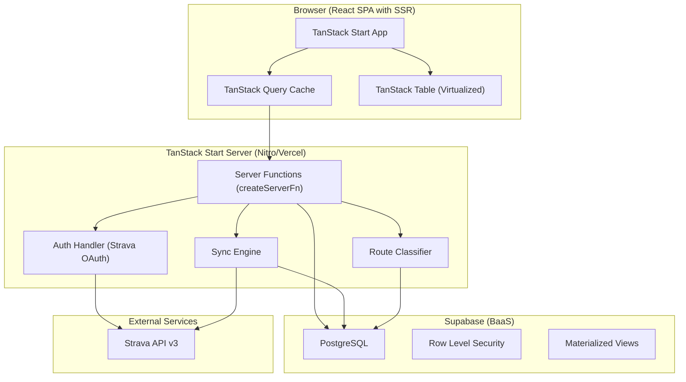
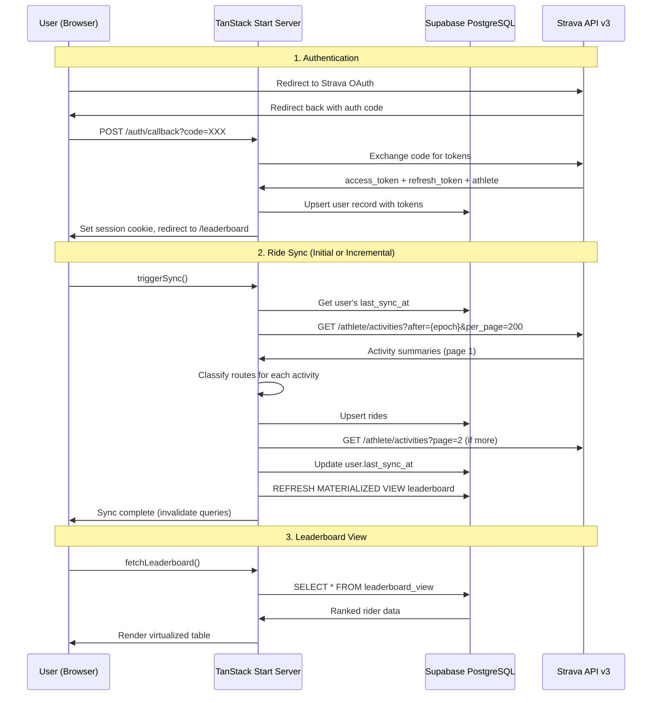

# SF2G Commute Tracker — System Architecture

> Architect Phase • 2026-05-25
> Version 1.0 — Implementation Blueprint for Coder Agent

---

## Table of Contents

1. [System Overview](#1-system-overview)
2. [Project Structure](#2-project-structure)
3. [Database Schema](#3-database-schema)
4. [Authentication Flow](#4-authentication-flow)
5. [API Layer](#5-api-layer)
6. [Data Sync Pipeline](#6-data-sync-pipeline)
7. [Route Classification System](#7-route-classification-system)
8. [Frontend Architecture](#8-frontend-architecture)
9. [Side Quest Decisions](#9-side-quest-decisions)
10. [Deployment & Infrastructure](#10-deployment--infrastructure)
11. [Open Decisions for User Input](#11-open-decisions-for-user-input)

---

## 1. System Overview

### 1.1 High-Level Architecture



### 1.2 Component Inventory

| Component | Technology | Responsibility |
|-----------|-----------|----------------|
| **App Shell** | TanStack Start + React | SSR, routing, hydration |
| **Data Layer** | TanStack Query v5 | Client-side caching, background refetching |
| **Leaderboard** | TanStack Table v8 + Virtual v3 | Virtualized, sortable, filterable table |
| **Charts** | Recharts v2 | Ride frequency time-series graphs |
| **Server Functions** | createServerFn (TanStack Start) | Server-side RPC endpoints |
| **Database** | Supabase PostgreSQL | Persistent storage with RLS |
| **Auth** | Custom Strava OAuth 2.0 | Login, token management, sessions |
| **Sync Engine** | Server functions + Strava API | Ride data fetching and storage |
| **Route Classifier** | Server-side TypeScript | GPS gateway/checkpoint-based classification |

### 1.3 Data Flow Diagram



---

## 2. Project Structure

### 2.1 Complete File/Folder Tree

```
sf2g/
├── app.config.ts                    # TanStack Start + Nitro config
├── package.json                     # Dependencies and scripts
├── tsconfig.json                    # TypeScript strict mode config
├── wrangler.toml                    # Cloudflare Pages config
├── .env.local                       # Local environment variables (gitignored)
├── .env.example                     # Template for env vars
├── .gitignore
│
├── app/
│   ├── client.tsx                   # Client entry point (hydrateRoot)
│   ├── router.tsx                   # Router configuration (createRouter)
│   ├── routeTree.gen.ts             # Auto-generated route tree
│   ├── ssr.tsx                      # SSR entry point
│   │
│   ├── routes/
│   │   ├── __root.tsx               # Root layout (html, head, body, QueryProvider, ThemeProvider)
│   │   ├── index.tsx                # Landing page — hero + public leaderboard preview
│   │   ├── leaderboard.tsx          # Main leaderboard page (virtualized table)
│   │   ├── auth/
│   │   │   ├── login.tsx            # Initiates Strava OAuth redirect
│   │   │   └── callback.tsx         # Handles OAuth callback, exchanges code, sets session
│   │   └── profile/
│   │       └── $userId.tsx          # Individual rider profile + ride history
│   │
│   ├── components/
│   │   ├── LeaderboardTable.tsx     # TanStack Table + Virtual implementation
│   │   ├── LeaderboardColumns.tsx   # Column definitions for the leaderboard
│   │   ├── RideFrequencyChart.tsx   # Recharts time-series chart
│   │   ├── NavBar.tsx               # Top navigation bar
│   │   ├── StravaLoginButton.tsx    # "Connect with Strava" CTA button
│   │   ├── SyncStatus.tsx           # Sync progress indicator
│   │   ├── RouteTag.tsx             # Color-coded route category badge
│   │   ├── ThemeToggle.tsx          # Dark/light mode toggle
│   │   ├── RideCard.tsx             # Individual ride display card
│   │   └── Footer.tsx               # Footer with links
│   │
│   ├── lib/
│   │   ├── supabase.ts              # Supabase client factory (anon + service role)
│   │   ├── database.types.ts        # Auto-generated Supabase types
│   │   ├── strava.ts                # Strava API client helpers
│   │   ├── strava-oauth.ts          # OAuth URL builders + token exchange
│   │   ├── route-classifier.ts      # Route classification algorithm
│   │   ├── polyline.ts              # Polyline decode utility
│   │   ├── rate-limiter.ts          # Strava rate limit tracker
│   │   ├── session.ts               # Session management (cookie-based)
│   │   └── constants.ts             # App-wide constants (route configs, bounding boxes)
│   │
│   ├── server/
│   │   ├── auth.ts                  # Server functions: loginRedirect, handleCallback, logout
│   │   ├── sync.ts                  # Server functions: triggerSync, getSyncStatus
│   │   ├── rides.ts                 # Server functions: fetchRides, fetchRideDetail
│   │   ├── leaderboard.ts           # Server functions: fetchLeaderboard
│   │   └── users.ts                 # Server functions: fetchCurrentUser, fetchUserProfile
│   │
│   ├── queries/
│   │   ├── leaderboard.ts           # queryOptions for leaderboard data
│   │   ├── rides.ts                 # queryOptions for user rides
│   │   └── user.ts                  # queryOptions for user profile/session
│   │
│   └── styles/
│       ├── global.css               # CSS reset + CSS custom properties (theme variables)
│       ├── leaderboard.css          # Leaderboard table styles
│       └── components.css           # Shared component styles
│
├── supabase/
│   └── migrations/
│       └── 001_initial_schema.sql   # Complete database schema
│
└── public/
    ├── favicon.ico
    ├── strava-connect-button.svg     # "Connect with Strava" brand asset
    └── og-image.png                  # Open Graph image for social sharing
```

### 2.2 File Purposes and Exports

| File | Purpose | Key Exports |
|------|---------|-------------|
| `app.config.ts` | TanStack Start + Vercel preset config | `default` config object |
| `app/client.tsx` | Client-side hydration entry | `hydrateRoot` call |
| `app/router.tsx` | Router creation with Query integration | `createRouter` function |
| `app/ssr.tsx` | SSR entry for Nitro | `default` handler |
| `app/routes/__root.tsx` | Root layout wrapping all pages | `Route` (root) |
| `app/routes/index.tsx` | Landing page | `Route` (/) |
| `app/routes/leaderboard.tsx` | Main leaderboard | `Route` (/leaderboard) |
| `app/routes/auth/login.tsx` | OAuth redirect initiator | `Route` (/auth/login) |
| `app/routes/auth/callback.tsx` | OAuth code exchange | `Route` (/auth/callback) |
| `app/routes/profile/$userId.tsx` | Rider profile | `Route` (/profile/$userId) |
| `app/lib/supabase.ts` | DB clients | `createAnonClient`, `createServiceClient` |
| `app/lib/database.types.ts` | Generated types | `Database`, `Tables` types |
| `app/lib/strava.ts` | Strava API helpers | `fetchAthleteActivities`, `fetchActivityDetail` |
| `app/lib/strava-oauth.ts` | OAuth logic | `getAuthorizationUrl`, `exchangeCode`, `refreshToken` |
| `app/lib/route-classifier.ts` | Classification | `classifyRoute`, `RouteCategory` |
| `app/lib/polyline.ts` | Polyline utils | `decodePolyline` |
| `app/lib/rate-limiter.ts` | Rate tracking | `RateLimiter` class |
| `app/lib/session.ts` | Cookie sessions | `getSession`, `setSession`, `clearSession` |
| `app/lib/constants.ts` | Config values | `ROUTE_CONFIGS`, `BOUNDING_BOXES`, `STRAVA_*` |
| `app/server/auth.ts` | Auth server fns | `loginRedirect`, `handleCallback`, `logout`, `getCurrentUser` |
| `app/server/sync.ts` | Sync server fns | `triggerSync`, `getSyncStatus` |
| `app/server/rides.ts` | Ride server fns | `fetchUserRides`, `fetchRidesByRoute` |
| `app/server/leaderboard.ts` | Leaderboard fns | `fetchLeaderboard`, `refreshLeaderboard` |
| `app/server/users.ts` | User server fns | `fetchCurrentUser`, `fetchUserProfile` |
| `app/queries/leaderboard.ts` | Query options | `leaderboardQueryOptions` |
| `app/queries/rides.ts` | Query options | `userRidesQueryOptions` |
| `app/queries/user.ts` | Query options | `currentUserQueryOptions` |

### 2.3 Package Dependencies

```json
{
  "name": "sf2g",
  "private": true,
  "type": "module",
  "scripts": {
    "dev": "tanstack-start dev",
    "build": "tanstack-start build",
    "preview": "wrangler pages dev .output/public",
    "deploy": "pnpm build && wrangler pages deploy .output/public",
    "typecheck": "tsc --noEmit",
    "db:types": "npx supabase gen types typescript --linked > app/lib/database.types.ts"
  },
  "dependencies": {
    "@supabase/supabase-js": "^2.45.0",
    "@tanstack/react-query": "^5.60.0",
    "@tanstack/react-router": "^1.80.0",
    "@tanstack/react-start": "^1.80.0",
    "@tanstack/react-table": "^8.20.0",
    "@tanstack/react-virtual": "^3.10.0",
    "react": "^19.0.0",
    "react-dom": "^19.0.0",
    "recharts": "^2.15.0",
    "@mapbox/polyline": "^2.0.0"
  },
  "devDependencies": {
    "@types/react": "^19.0.0",
    "@types/react-dom": "^19.0.0",
    "typescript": "^5.7.0",
    "supabase": "^1.200.0",
    "vinxi": "^0.5.0",
    "wrangler": "^3.90.0"
  }
}
```

> **Note:** Use `pnpm` as the package manager. Run `pnpm install` instead of `npm install`.

---

## 3. Database Schema

### 3.1 Complete SQL — Migration 001

```sql
-- ============================================================
-- SF2G Commute Tracker — Initial Schema
-- Migration: 001_initial_schema.sql
-- ============================================================

-- Enable required extensions
CREATE EXTENSION IF NOT EXISTS "pgcrypto";

-- ============================================================
-- USERS TABLE
-- ============================================================
CREATE TABLE users (
  id UUID PRIMARY KEY DEFAULT gen_random_uuid(),
  strava_id BIGINT UNIQUE NOT NULL,
  username TEXT,
  first_name TEXT,
  last_name TEXT,
  display_name TEXT GENERATED ALWAYS AS (
    COALESCE(first_name || ' ' || last_name, username, 'Anonymous')
  ) STORED,
  avatar_url TEXT,

  -- Strava OAuth tokens (stored server-side only)
  strava_access_token TEXT NOT NULL,
  strava_refresh_token TEXT NOT NULL,
  strava_token_expires_at TIMESTAMPTZ NOT NULL,
  strava_scopes TEXT, -- comma-separated granted scopes

  -- Sync metadata
  last_sync_at TIMESTAMPTZ,
  last_activity_at TIMESTAMPTZ, -- timestamp of most recent synced activity

  -- Timestamps
  created_at TIMESTAMPTZ NOT NULL DEFAULT now(),
  updated_at TIMESTAMPTZ NOT NULL DEFAULT now()
);

CREATE INDEX idx_users_strava_id ON users(strava_id);

-- ============================================================
-- RIDES TABLE
-- ============================================================
CREATE TABLE rides (
  id UUID PRIMARY KEY DEFAULT gen_random_uuid(),
  user_id UUID NOT NULL REFERENCES users(id) ON DELETE CASCADE,
  strava_activity_id BIGINT UNIQUE NOT NULL,

  -- Ride metadata
  name TEXT,
  ride_date DATE NOT NULL,
  start_date TIMESTAMPTZ NOT NULL,
  timezone TEXT,

  -- Classification
  route_category TEXT CHECK (route_category IN ('bayway', 'skyline', 'hmbw', 'royale', 'other')),
  classification_confidence REAL, -- 0.0 to 1.0
  classification_method TEXT CHECK (classification_method IN ('gateway', 'elevation', 'manual')),

  -- Metrics
  distance_meters REAL,
  moving_time_seconds INTEGER,
  elapsed_time_seconds INTEGER,
  elevation_gain_meters REAL,
  average_speed_mps REAL, -- meters per second
  max_speed_mps REAL,

  -- GPS data
  start_latlng JSONB, -- [lat, lng]
  end_latlng JSONB,   -- [lat, lng]
  summary_polyline TEXT,

  -- Strava flags
  is_commute BOOLEAN DEFAULT false,
  is_private BOOLEAN DEFAULT false,

  -- Raw Strava data (for debugging / reprocessing)
  strava_raw JSONB,

  -- Timestamps
  created_at TIMESTAMPTZ NOT NULL DEFAULT now()
);

CREATE INDEX idx_rides_user_id ON rides(user_id);
CREATE INDEX idx_rides_ride_date ON rides(ride_date DESC);
CREATE INDEX idx_rides_route_category ON rides(route_category);
CREATE INDEX idx_rides_strava_activity_id ON rides(strava_activity_id);
CREATE INDEX idx_rides_start_date ON rides(start_date DESC);

-- NOTE: Route classification uses GPS gateway/checkpoint coordinates
-- defined in app/lib/constants.ts, NOT Strava segments.
-- No route_segments table needed.

-- ============================================================
-- LEADERBOARD MATERIALIZED VIEW
-- ============================================================
CREATE MATERIALIZED VIEW leaderboard_view AS
SELECT
  u.id AS user_id,
  u.display_name,
  u.avatar_url,
  u.username,
  COUNT(r.id) AS total_rides,
  COUNT(r.id) FILTER (WHERE r.route_category = 'bayway') AS bayway_count,
  COUNT(r.id) FILTER (WHERE r.route_category = 'skyline') AS skyline_count,
  COUNT(r.id) FILTER (WHERE r.route_category = 'hmbw') AS hmbw_count,
  COUNT(r.id) FILTER (WHERE r.route_category = 'royale') AS royale_count,
  COUNT(r.id) FILTER (WHERE r.route_category = 'other') AS other_count,
  COALESCE(SUM(r.distance_meters), 0) AS total_distance_meters,
  COALESCE(SUM(r.elevation_gain_meters), 0) AS total_elevation_meters,
  COALESCE(AVG(r.average_speed_mps), 0) AS avg_speed_mps,
  MAX(r.ride_date) AS last_ride_date,
  MIN(r.ride_date) AS first_ride_date
FROM users u
LEFT JOIN rides r ON u.id = r.user_id
GROUP BY u.id, u.display_name, u.avatar_url, u.username;

-- Unique index required for CONCURRENTLY refresh
CREATE UNIQUE INDEX idx_leaderboard_view_user_id ON leaderboard_view(user_id);

-- ============================================================
-- MONTHLY STATS VIEW (for charts)
-- ============================================================
CREATE VIEW monthly_ride_stats AS
SELECT
  u.id AS user_id,
  DATE_TRUNC('month', r.ride_date) AS month,
  r.route_category,
  COUNT(*) AS ride_count,
  SUM(r.distance_meters) AS total_distance,
  AVG(r.average_speed_mps) AS avg_speed
FROM users u
JOIN rides r ON u.id = r.user_id
GROUP BY u.id, DATE_TRUNC('month', r.ride_date), r.route_category;

-- ============================================================
-- ROW LEVEL SECURITY
-- ============================================================
ALTER TABLE users ENABLE ROW LEVEL SECURITY;
ALTER TABLE rides ENABLE ROW LEVEL SECURITY;

-- Public reads: Anyone can view the leaderboard and ride data
CREATE POLICY "Public read access for users"
  ON users FOR SELECT
  USING (true);

CREATE POLICY "Public read access for rides"
  ON rides FOR SELECT
  USING (true);

-- Deny anon writes explicitly
CREATE POLICY "Deny anon insert on users"
  ON users FOR INSERT
  WITH CHECK (false);

CREATE POLICY "Deny anon update on users"
  ON users FOR UPDATE
  USING (false);

CREATE POLICY "Deny anon insert on rides"
  ON rides FOR INSERT
  WITH CHECK (false);

CREATE POLICY "Deny anon update on rides"
  ON rides FOR UPDATE
  USING (false);

-- ============================================================
-- HELPER FUNCTIONS
-- ============================================================

-- Function to refresh leaderboard (called after sync)
CREATE OR REPLACE FUNCTION refresh_leaderboard()
RETURNS void AS $$
BEGIN
  REFRESH MATERIALIZED VIEW CONCURRENTLY leaderboard_view;
END;
$$ LANGUAGE plpgsql SECURITY DEFINER;

-- Updated_at trigger
CREATE OR REPLACE FUNCTION update_updated_at_column()
RETURNS TRIGGER AS $$
BEGIN
  NEW.updated_at = now();
  RETURN NEW;
END;
$$ LANGUAGE plpgsql;

CREATE TRIGGER set_users_updated_at
  BEFORE UPDATE ON users
  FOR EACH ROW
  EXECUTE FUNCTION update_updated_at_column();
```

### 3.2 Migration Strategy

1. **Development**: Use Supabase CLI (`supabase db push`) to apply migrations locally
2. **Production**: Use Supabase Dashboard SQL editor or `supabase db push --linked` for the hosted project
3. **Schema changes**: Create new numbered migration files (e.g., `002_add_column.sql`)
4. **Rollback**: Each migration should have a corresponding `down` SQL (drop tables, remove columns)

### 3.3 Type Generation Workflow

```bash
# Link to Supabase project (one-time)
npx supabase link --project-ref <PROJECT_REF>

# Generate types after any schema change
pnpm db:types
# This runs: npx supabase gen types typescript --linked > app/lib/database.types.ts
```

The generated types provide full type safety:

```typescript
import type { Database } from './database.types'

// Derived helper types
type Tables = Database['public']['Tables']
export type User = Tables['users']['Row']
export type UserInsert = Tables['users']['Insert']
export type Ride = Tables['rides']['Row']
export type RideInsert = Tables['rides']['Insert']

// Leaderboard view type (from materialized view)
type Views = Database['public']['Views']
export type LeaderboardEntry = Views['leaderboard_view']['Row']
```

---

## 4. Authentication Flow

### 4.1 Session Strategy

**Approach: Signed HTTP-only cookies (no Supabase Auth)**

Since Supabase doesn't have a built-in Strava OAuth provider, we handle auth entirely in server functions:

1. Server function exchanges Strava code for tokens
2. Server stores tokens in `users` table
3. Server sets an HTTP-only, signed cookie containing the user's `id` (UUID)
4. Every subsequent request reads the cookie to identify the user
5. Cookie is signed with a server-side secret to prevent tampering

```typescript
// app/lib/session.ts
import { getCookie, setCookie, deleteCookie } from 'vinxi/http'

const SESSION_COOKIE = 'sf2g_session'
const SESSION_SECRET = process.env.SESSION_SECRET! // 32+ char random string

export interface SessionData {
  userId: string   // UUID
  stravaId: number
}

export function getSession(): SessionData | null {
  const raw = getCookie(SESSION_COOKIE)
  if (!raw) return null
  try {
    const decoded = JSON.parse(Buffer.from(raw, 'base64url').toString())
    return decoded as SessionData
  } catch {
    return null
  }
}

export function setSession(data: SessionData): void {
  const encoded = Buffer.from(JSON.stringify(data)).toString('base64url')
  setCookie(SESSION_COOKIE, encoded, {
    httpOnly: true,
    secure: process.env.NODE_ENV === 'production',
    sameSite: 'lax',
    maxAge: 60 * 60 * 24 * 30, // 30 days
    path: '/',
  })
}

export function clearSession(): void {
  deleteCookie(SESSION_COOKIE)
}
```

### 4.2 Step-by-Step Strava OAuth Flow

#### Step 1: User clicks "Connect with Strava"

```typescript
// app/server/auth.ts
import { createServerFn } from '@tanstack/react-start'

export const getStravaAuthUrl = createServerFn({ method: 'GET' })
  .handler(async () => {
    const params = new URLSearchParams({
      client_id: process.env.STRAVA_CLIENT_ID!,
      redirect_uri: `${process.env.APP_URL}/auth/callback`,
      response_type: 'code',
      scope: 'read,activity:read_all',
      approval_prompt: 'auto',
      state: crypto.randomUUID(), // CSRF protection
    })
    return `https://www.strava.com/oauth/authorize?${params.toString()}`
  })
```

#### Step 2: Strava redirects back with authorization code

```
GET /auth/callback?code=AUTHORIZATION_CODE&scope=read,activity:read_all&state=abc123
```

#### Step 3: Exchange code for tokens + upsert user

```typescript
// app/server/auth.ts
export const handleStravaCallback = createServerFn({ method: 'GET' })
  .validator((input: { code: string; scope: string; state: string }) => input)
  .handler(async ({ data }) => {
    // 1. Exchange authorization code for tokens
    const tokenResponse = await fetch('https://www.strava.com/oauth/token', {
      method: 'POST',
      headers: { 'Content-Type': 'application/json' },
      body: JSON.stringify({
        client_id: process.env.STRAVA_CLIENT_ID,
        client_secret: process.env.STRAVA_CLIENT_SECRET,
        code: data.code,
        grant_type: 'authorization_code',
      }),
    })

    if (!tokenResponse.ok) {
      throw new Error(`Token exchange failed: ${tokenResponse.status}`)
    }

    const tokenData = await tokenResponse.json()

    // 2. Upsert user in database (service role client bypasses RLS)
    const supabase = createServiceClient()
    const { data: user, error } = await supabase
      .from('users')
      .upsert({
        strava_id: tokenData.athlete.id,
        username: tokenData.athlete.username,
        first_name: tokenData.athlete.firstname,
        last_name: tokenData.athlete.lastname,
        avatar_url: tokenData.athlete.profile,
        strava_access_token: tokenData.access_token,
        strava_refresh_token: tokenData.refresh_token,
        strava_token_expires_at: new Date(tokenData.expires_at * 1000).toISOString(),
        strava_scopes: data.scope,
      }, {
        onConflict: 'strava_id',
      })
      .select('id, strava_id')
      .single()

    if (error) throw error

    // 3. Set session cookie
    setSession({ userId: user.id, stravaId: user.strava_id })

    // 4. Return redirect URL
    return { redirectTo: '/leaderboard' }
  })
```

#### Step 4: Token Refresh (transparent, before API calls)

```typescript
// app/lib/strava-oauth.ts
export async function ensureValidToken(userId: string): Promise<string> {
  const supabase = createServiceClient()
  const { data: user } = await supabase
    .from('users')
    .select('strava_access_token, strava_refresh_token, strava_token_expires_at')
    .eq('id', userId)
    .single()

  if (!user) throw new Error('User not found')

  // Check if token is still valid (with 5-minute buffer)
  const expiresAt = new Date(user.strava_token_expires_at).getTime()
  const now = Date.now()
  const BUFFER = 5 * 60 * 1000 // 5 minutes

  if (now < expiresAt - BUFFER) {
    return user.strava_access_token // Still valid
  }

  // Refresh the token
  const refreshResponse = await fetch('https://www.strava.com/oauth/token', {
    method: 'POST',
    headers: { 'Content-Type': 'application/json' },
    body: JSON.stringify({
      client_id: process.env.STRAVA_CLIENT_ID,
      client_secret: process.env.STRAVA_CLIENT_SECRET,
      grant_type: 'refresh_token',
      refresh_token: user.strava_refresh_token,
    }),
  })

  if (!refreshResponse.ok) {
    throw new Error(`Token refresh failed: ${refreshResponse.status}`)
  }

  const newTokens = await refreshResponse.json()

  // CRITICAL: Store the new refresh token (it may have changed)
  await supabase
    .from('users')
    .update({
      strava_access_token: newTokens.access_token,
      strava_refresh_token: newTokens.refresh_token,
      strava_token_expires_at: new Date(newTokens.expires_at * 1000).toISOString(),
    })
    .eq('id', userId)

  return newTokens.access_token
}
```

### 4.3 Logout

```typescript
export const logout = createServerFn({ method: 'POST' })
  .handler(async () => {
    clearSession()
    return { redirectTo: '/' }
  })
```

---

## 5. API Layer

### 5.1 Server Functions — Complete Inventory

#### Auth Functions (`app/server/auth.ts`)

```typescript
// Get Strava OAuth URL for login redirect
export const getStravaAuthUrl = createServerFn({ method: 'GET' })
  .handler(async () => string)

// Handle OAuth callback — exchange code, upsert user, set session
export const handleStravaCallback = createServerFn({ method: 'GET' })
  .validator((input: { code: string; scope: string; state: string }) => input)
  .handler(async ({ data }) => { redirectTo: string })

// Get current logged-in user from session
export const getCurrentUser = createServerFn({ method: 'GET' })
  .handler(async () => User | null)

// Logout — clear session cookie
export const logout = createServerFn({ method: 'POST' })
  .handler(async () => { redirectTo: string })
```

#### Sync Functions (`app/server/sync.ts`)

```typescript
// Trigger ride sync for the current user
export const triggerSync = createServerFn({ method: 'POST' })
  .handler(async () => {
    newRides: number
    totalProcessed: number
    errors: string[]
  })
```

#### Ride Functions (`app/server/rides.ts`)

```typescript
// Fetch rides for a specific user
export const fetchUserRides = createServerFn({ method: 'GET' })
  .validator((input: { userId: string; limit?: number; offset?: number; routeCategory?: string }) => input)
  .handler(async ({ data }) => Ride[])
```

#### Leaderboard Functions (`app/server/leaderboard.ts`)

```typescript
// Fetch leaderboard data (from materialized view)
export const fetchLeaderboard = createServerFn({ method: 'GET' })
  .handler(async () => LeaderboardEntry[])
```

#### User Functions (`app/server/users.ts`)

```typescript
// Fetch a user's public profile
export const fetchUserProfile = createServerFn({ method: 'GET' })
  .validator((input: { userId: string }) => input)
  .handler(async ({ data }) => User)
```

### 5.2 Supabase Client Configuration

```typescript
// app/lib/supabase.ts
import { createClient, type SupabaseClient } from '@supabase/supabase-js'
import type { Database } from './database.types'

// ANON client — respects RLS policies. Use for public reads.
export function createAnonClient(): SupabaseClient<Database> {
  return createClient<Database>(
    process.env.SUPABASE_URL!,
    process.env.SUPABASE_ANON_KEY!
  )
}

// SERVICE ROLE client — bypasses RLS. Use for server-side writes (sync, auth).
// NEVER expose to client code.
export function createServiceClient(): SupabaseClient<Database> {
  return createClient<Database>(
    process.env.SUPABASE_URL!,
    process.env.SUPABASE_SERVICE_ROLE_KEY!
  )
}
```

**Usage rules:**
- `createAnonClient()` → reading leaderboard, public ride data
- `createServiceClient()` → upserting users, inserting rides, refreshing tokens

### 5.3 Rate Limiting Strategy

> **Cloudflare Workers are stateless** — in-memory rate limit state resets between requests.
> Instead, we rely on Strava's `X-RateLimit-Usage` response headers and `429` status codes.

```typescript
// app/lib/rate-limiter.ts

// Strava Read Rate Limits (more restrictive than overall limits)
// Overall: 200/15min, 2000/day — but READ is 100/15min, 1000/day
const LIMIT_15MIN = 100
const LIMIT_DAILY = 1000
const SAFETY_MARGIN = 0.85

/**
 * Check Strava response headers for rate limit status.
 * Returns true if we're approaching the limit and should stop.
 */
export function isApproachingLimit(headers: Headers): boolean {
  const usage = headers.get('X-RateLimit-Usage')
  if (!usage) return false

  const [short, daily] = usage.split(',').map(Number)
  return (
    short >= LIMIT_15MIN * SAFETY_MARGIN ||
    daily >= LIMIT_DAILY * SAFETY_MARGIN
  )
}

/**
 * Fetch from Strava API with rate limit awareness.
 * - Reads X-RateLimit-Usage from responses
 * - Retries on 429 with short exponential backoff
 * - Fails fast if approaching limits (returns error for client to retry later)
 */
export async function fetchWithRateLimit(
  url: string,
  accessToken: string,
  maxRetries = 3
): Promise<Response> {
  for (let attempt = 0; attempt < maxRetries; attempt++) {
    const res = await fetch(url, {
      headers: { Authorization: `Bearer ${accessToken}` },
    })

    if (res.status === 429) {
      // Short backoff (Cloudflare Workers support short setTimeout)
      const backoffMs = Math.min(Math.pow(2, attempt) * 2_000, 10_000)
      await new Promise(resolve => setTimeout(resolve, backoffMs))
      continue
    }

    // Check if we're approaching limits — return response but signal to caller
    if (isApproachingLimit(res.headers)) {
      // Attach a flag so the sync pipeline can stop gracefully
      ;(res as any).__approachingRateLimit = true
    }

    return res
  }
  throw new Error(`Strava API: Rate limited after ${maxRetries} retries for ${url}`)
}
```

---

## 6. Data Sync Pipeline

### 6.1 Sync Implementation

```typescript
// app/server/sync.ts — triggerSync implementation

async function performSync(userId: string): Promise<SyncResult> {
  const supabase = createServiceClient()
  const accessToken = await ensureValidToken(userId)

  // Determine if initial or incremental
  const { data: user } = await supabase
    .from('users')
    .select('last_activity_at')
    .eq('id', userId)
    .single()

  const isInitialSync = !user?.last_activity_at
  let allNewRides: RideInsert[] = []
  let page = 1
  let hasMore = true
  const errors: string[] = []

  const baseUrl = 'https://www.strava.com/api/v3/athlete/activities'
  const params = new URLSearchParams({ per_page: '200' })

  // For incremental sync, only fetch activities after last synced
  if (!isInitialSync && user?.last_activity_at) {
    const afterEpoch = Math.floor(new Date(user.last_activity_at).getTime() / 1000)
    params.set('after', afterEpoch.toString())
  }

  // Paginate through all activities
  while (hasMore) {
    params.set('page', page.toString())
    const url = `${baseUrl}?${params.toString()}`

    try {
      const res = await fetchWithRateLimit(url, accessToken)
      if (!res.ok) {
        errors.push(`Page ${page}: HTTP ${res.status}`)
        break
      }

      const activities = await res.json()
      if (activities.length === 0) {
        hasMore = false
        break
      }

      // Filter to cycling activities only
      const cyclingActivities = activities.filter(
        (a: any) => a.type === 'Ride' && !a.manual
      )

      // Classify and transform each activity
      for (const activity of cyclingActivities) {
        const classification = classifyRoute(activity)
        allNewRides.push({
          user_id: userId,
          strava_activity_id: activity.id,
          name: activity.name,
          ride_date: activity.start_date_local.split('T')[0],
          start_date: activity.start_date,
          timezone: activity.timezone,
          route_category: classification.category,
          classification_confidence: classification.confidence,
          classification_method: classification.method,
          distance_meters: activity.distance,
          moving_time_seconds: activity.moving_time,
          elapsed_time_seconds: activity.elapsed_time,
          elevation_gain_meters: activity.total_elevation_gain,
          average_speed_mps: activity.average_speed,
          max_speed_mps: activity.max_speed,
          start_latlng: activity.start_latlng,
          end_latlng: activity.end_latlng,
          summary_polyline: activity.map?.summary_polyline,
          is_commute: activity.commute ?? false,
          is_private: activity.private ?? false,
          strava_raw: activity,
        })
      }

      if (activities.length < 200) {
        hasMore = false
      } else {
        page++
      }
    } catch (err) {
      errors.push(`Page ${page}: ${err instanceof Error ? err.message : 'Unknown error'}`)
      break
    }
  }

  // Batch upsert rides
  if (allNewRides.length > 0) {
    const BATCH_SIZE = 100
    for (let i = 0; i < allNewRides.length; i += BATCH_SIZE) {
      const batch = allNewRides.slice(i, i + BATCH_SIZE)
      const { error } = await supabase
        .from('rides')
        .upsert(batch, { onConflict: 'strava_activity_id' })
      if (error) {
        errors.push(`Batch upsert error: ${error.message}`)
      }
    }
  }

  // Update user's sync metadata
  const latestActivity = allNewRides.reduce((latest, ride) => {
    return !latest || ride.start_date > latest ? ride.start_date : latest
  }, user?.last_activity_at as string | null)

  await supabase
    .from('users')
    .update({
      last_sync_at: new Date().toISOString(),
      last_activity_at: latestActivity,
    })
    .eq('id', userId)

  // Refresh the materialized view
  await supabase.rpc('refresh_leaderboard')

  return {
    newRides: allNewRides.length,
    totalProcessed: allNewRides.length,
    errors,
  }
}
```

### 6.2 Webhook vs Polling: MVP Decision

**Decision: Polling only for MVP. Defer webhooks.**

**Rationale:**
- Webhooks require publicly-accessible HTTPS endpoint with challenge/response verification
- Only 1 subscription per Strava app (complicates dev/staging/prod)
- Webhook payload only contains the activity ID — still requires an API call
- For MVP, sync-on-login and manual "Sync Now" button is sufficient

### 6.3 Sync Trigger Points

1. **On login (new user):** Automatic initial sync after OAuth callback
2. **On login (returning user):** Automatic incremental sync
3. **Manual "Sync Now" button:** User-triggered sync on leaderboard page

### 6.4 Error Handling

| Error | Handling |
|-------|----------|
| HTTP 429 (Rate limited) | Exponential backoff (5s, 10s, 20s), max 3 retries |
| HTTP 401 (Token expired) | Auto-refresh token, retry once |
| HTTP 5xx (Strava down) | Log error, stop sync, show user message |
| Network error | Retry up to 3 times with exponential backoff |
| Partial sync failure | Store what we have, log errors, let user retry |
| Duplicate activities | `UPSERT ... ON CONFLICT (strava_activity_id)` — idempotent |

---

## 7. Route Classification System

### 7.1 Approach: GPS Gateway/Checkpoint Classification

**Key insight from user**: No Strava segment IDs are available for SF2G routes. Instead, we use **GPS gateway checkpoints** — specific geographic coordinates that a ride must pass through (within a radius) to be classified as a particular route.

Each corridor has 1-2 **definitive gateway points** that are geographically exclusive to that route. We decode the `summary_polyline` (free with activity list — no extra API call) and check if any decoded GPS points pass near these gateways.

### 7.2 Two-Layer Algorithm

```typescript
// app/lib/route-classifier.ts

import { decodePolyline } from './polyline'
import { ROUTE_GATEWAYS } from './constants'

export type RouteCategory = 'bayway' | 'skyline' | 'hmbw' | 'royale' | 'other'

export interface ClassificationResult {
  category: RouteCategory
  confidence: number   // 0.0 - 1.0
  method: 'gateway' | 'elevation' | 'manual'
  matchedGateways?: string[]
}

export function classifyRoute(activity: any): ClassificationResult {
  // Layer 1: GPS gateway matching (primary, high confidence)
  const gatewayResult = classifyByGateways(activity)
  if (gatewayResult && gatewayResult.confidence >= 0.7) {
    return gatewayResult
  }

  // Layer 2: Elevation heuristic (fallback / low confidence)
  const elevationResult = classifyByElevation(activity)
  if (elevationResult) {
    return elevationResult
  }

  return { category: 'other', confidence: 0, method: 'gateway' }
}
```

### 7.3 Layer 1: GPS Gateway Classification

```typescript
// Haversine distance in meters between two lat/lng points
function haversineDistance(
  lat1: number, lng1: number,
  lat2: number, lng2: number
): number {
  const R = 6371000 // Earth radius in meters
  const dLat = (lat2 - lat1) * Math.PI / 180
  const dLng = (lng2 - lng1) * Math.PI / 180
  const a =
    Math.sin(dLat / 2) ** 2 +
    Math.cos(lat1 * Math.PI / 180) * Math.cos(lat2 * Math.PI / 180) *
    Math.sin(dLng / 2) ** 2
  return R * 2 * Math.atan2(Math.sqrt(a), Math.sqrt(1 - a))
}

const GATEWAY_RADIUS_METERS = 500 // Match if ride passes within 500m of gateway

function classifyByGateways(activity: any): ClassificationResult | null {
  const polyline = activity.summary_polyline || activity.map?.summary_polyline
  if (!polyline) return null

  const points = decodePolyline(polyline)
  if (points.length < 10) return null

  // Check each route's gateways
  const matchedRoutes: Map<RouteCategory, string[]> = new Map()

  for (const gateway of ROUTE_GATEWAYS) {
    for (const [lat, lng] of points) {
      const distance = haversineDistance(lat, lng, gateway.lat, gateway.lng)
      if (distance <= GATEWAY_RADIUS_METERS) {
        const existing = matchedRoutes.get(gateway.category) || []
        if (!existing.includes(gateway.name)) {
          existing.push(gateway.name)
          matchedRoutes.set(gateway.category, existing)
        }
        break // This gateway is matched, move to next gateway
      }
    }
  }

  if (matchedRoutes.size === 0) return null

  // If only one route matched, high confidence
  if (matchedRoutes.size === 1) {
    const [category, gateways] = [...matchedRoutes.entries()][0]
    return {
      category,
      confidence: gateways.length >= 2 ? 0.95 : 0.8,
      method: 'gateway',
      matchedGateways: gateways,
    }
  }

  // Multiple routes matched — pick the one with most gateway hits
  let bestCategory: RouteCategory = 'other'
  let bestCount = 0
  let bestGateways: string[] = []

  for (const [category, gateways] of matchedRoutes) {
    if (gateways.length > bestCount) {
      bestCount = gateways.length
      bestCategory = category
      bestGateways = gateways
    }
  }

  return {
    category: bestCategory,
    confidence: 0.7, // Lower confidence when multiple routes match
    method: 'gateway',
    matchedGateways: bestGateways,
  }
}
```

### 7.4 Layer 2: Elevation Heuristic (Fallback)

```typescript
function classifyByElevation(activity: any): ClassificationResult | null {
  const elevGain = activity.total_elevation_gain || activity.elevation_gain_meters
  const distance = activity.distance || activity.distance_meters
  if (!elevGain || !distance) return null

  if (distance < 40_000) return null // Minimum 40km for commute

  const startLng = activity.start_latlng?.[1]
  const endLng = activity.end_latlng?.[1]

  if (elevGain > 2500) {
    return { category: 'skyline', confidence: 0.5, method: 'elevation' }
  }
  if (elevGain > 2000 && startLng && startLng < -122.45) {
    return { category: 'hmbw', confidence: 0.4, method: 'elevation' }
  }
  if (elevGain < 1000 && endLng && endLng > -122.25) {
    return { category: 'bayway', confidence: 0.4, method: 'elevation' }
  }
  if (elevGain < 1200) {
    return { category: 'royale', confidence: 0.3, method: 'elevation' }
  }

  return null
}
```

### 7.5 Gateway Definitions

```typescript
// app/lib/constants.ts

export interface RouteGateway {
  category: RouteCategory
  name: string
  lat: number
  lng: number
  description: string
}

// GPS gateway/checkpoint coordinates for route classification.
// A ride is classified by which gateway(s) its decoded polyline passes through.
// Each gateway is chosen because it's geographically exclusive to one corridor.
//
// The 4 corridors are geographically separated:
// - HMBW: Coastal route (west) — goes through Devil's Slide
// - Skyline: Ridge route (mountain) — rides along Skyline Blvd at elevation
// - Bayway: Bay shore route (east) — follows the bay trail / Foster City
// - Royale: Valley floor route (middle) — El Camino Real corridor
export const ROUTE_GATEWAYS: RouteGateway[] = [
  // HMBW — Coastal route (west), goes through Devil's Slide area
  {
    category: 'hmbw',
    name: 'HMBW South (near Half Moon Bay)',
    lat: 37.448732,
    lng: -122.429176,
    description: 'Coastal corridor south checkpoint, near Half Moon Bay',
  },
  {
    category: 'hmbw',
    name: 'HMBW North (Devil\'s Slide)',
    lat: 37.578030,
    lng: -122.512407,
    description: 'Coastal corridor north checkpoint, near Devil\'s Slide / Pacifica',
  },

  // Skyline — Ridge route (mountain), along Skyline Blvd
  {
    category: 'skyline',
    name: 'Skyline North (near Daly City)',
    lat: 37.668433,
    lng: -122.485198,
    description: 'Skyline Blvd northern entry near Daly City / Olympic Club',
  },
  {
    category: 'skyline',
    name: 'Skyline South (Kings Mountain)',
    lat: 37.483905,
    lng: -122.315759,
    description: 'Skyline Blvd southern checkpoint near Kings Mountain / Woodside',
  },

  // Bayway — Bay shore route (east), follows the bay trail
  {
    category: 'bayway',
    name: 'Bayway North (near SFO / Millbrae)',
    lat: 37.683980,
    lng: -122.389961,
    description: 'Bay Trail northern checkpoint near SFO / Millbrae',
  },
  {
    category: 'bayway',
    name: 'Bayway South (Foster City / San Mateo)',
    lat: 37.579180,
    lng: -122.310702,
    description: 'Bay Trail southern checkpoint near Foster City / San Mateo',
  },

  // Royale — Valley floor route (middle), El Camino Real corridor
  {
    category: 'royale',
    name: 'Royale North (Daly City / Colma)',
    lat: 37.625271,
    lng: -122.414288,
    description: 'El Camino Real northern checkpoint near Daly City / Colma',
  },
  {
    category: 'royale',
    name: 'Royale South (San Carlos / Belmont)',
    lat: 37.520997,
    lng: -122.276718,
    description: 'El Camino Real southern checkpoint near San Carlos / Belmont',
  },
]

// Known landmark coordinates used for feature detection
// (not for route classification, but for social features like "morning ride from PPR")
export interface KnownLandmark {
  name: string
  lat: number
  lng: number
  description: string
}

// PPR = Peet's Coffee at Park Presidio — the classic SF2G departure point
export const PPR_COORDS: KnownLandmark = {
  name: 'PPR (Peet\'s Coffee at Park Presidio)',
  lat: 37.773433,
  lng: -122.438898,
  description: 'Classic SF2G morning departure point',
}

// Known ride intercept points — where riders join the group mid-route
export const KNOWN_INTERCEPTS: KnownLandmark[] = [
  {
    name: 'JD/Skyline',
    lat: 37.698413,
    lng: -122.495000,
    description: 'Common intercept point where riders join on Skyline Blvd',
  },
  // Add more intercepts as the community identifies them
]
```

### 7.6 How It Works — Visual Summary

```
            SF (start)
               |
    HMBW ← ←  |  → → Bayway
   (coast)     |      (bay shore)
   37.578°     |      37.684°
  -122.512°    |     -122.390°
            Skyline
            (ridge)
            37.668°
           -122.485°
               |
           Royale
        (valley floor)
         37.625°
        -122.414°
               |
          ... south ...
               |
    HMBW       |       Bayway
   37.449°  Skyline   37.579°
  -122.429° 37.484°  -122.311°
           -122.316°
               |
           Royale
          37.521°
         -122.277°
               |
           Destination
        (below SF)
```

### 7.7 Confidence Scoring Summary

| Method | Condition | Confidence |
|--------|-----------|------------|
| Gateway | 2+ gateways matched, single route | 0.95 |
| Gateway | 1 gateway matched, single route | 0.80 |
| Gateway | Multiple routes matched (ambiguous) | 0.70 |
| Elevation | Strong signal (Skyline >2500ft gain) | 0.50 |
| Elevation | Moderate signal | 0.30-0.40 |

### 7.8 Future Improvements

- **Community-tuned gateways**: Let riders suggest/correct gateway coordinates
- **Strava segment IDs**: If specific segments are identified per corridor later, add as an additional classification layer
- **Machine learning**: With enough classified rides, train a model on polyline features

---

## 8. Frontend Architecture

### 8.1 Route Tree

| URL | File | Description | Auth Required |
|-----|------|-------------|---------------|
| `/` | `routes/index.tsx` | Landing page with hero, public leaderboard preview | No |
| `/leaderboard` | `routes/leaderboard.tsx` | Full virtualized leaderboard | No |
| `/routes` | `routes/routes.tsx` | Route corridors info + gateway map | No |
| `/auth/login` | `routes/auth/login.tsx` | Redirects to Strava OAuth | No |
| `/auth/callback` | `routes/auth/callback.tsx` | Handles OAuth return | No |
| `/profile/$userId` | `routes/profile/$userId.tsx` | Rider profile + ride history | No |

### 8.2 Component Hierarchy

```
__root.tsx (Root Layout)
├── NavBar
│   ├── Logo / App Title
│   ├── Nav Links (Home, Leaderboard)
│   ├── ThemeToggle (dark/light)
│   └── StravaLoginButton (or user avatar + logout)
├── <Outlet /> (page content)
└── Footer

index.tsx (Landing Page)
├── Hero Section
│   ├── Headline ("SF2G Commute Tracker")
│   ├── Subheadline
│   └── StravaLoginButton (large CTA)
├── Leaderboard Preview (top 10 rows, non-virtualized)
└── Route Info Cards (4 corridor descriptions, link to /routes)

routes.tsx (Routes Info Page) ✨ NEW
├── Page Header ("SF2G Route Corridors")
├── Route Detail Cards × 4
│   ├── Route name + color badge
│   ├── Description & notable landmarks
│   ├── Gateway checkpoints (lat/lng + map link)
│   └── Typical stats (elevation, distance)
├── How Classification Works
│   ├── Explanation of gateway checkpoints
│   ├── 500m radius visual explanation
│   └── Confidence scoring overview
└── Interactive Map (optional — static image showing gateway positions for MVP)

leaderboard.tsx (Main Leaderboard)
├── SyncStatus (if logged in — shows last sync, "Sync Now" button)
├── Filters Bar
│   ├── Route Category Dropdown (All / Bayway / Skyline / HMBW / Royale)
│   ├── Time Period Selector (All Time / This Year / This Month)
│   └── Search Input (filter by rider name)
└── LeaderboardTable (virtualized)
    └── Columns: Rank, Avatar, Name, Total Rides, Bayway, Skyline, HMBW, Royale, Avg Speed, Last Ride

profile/$userId.tsx (Rider Profile)
├── Profile Header (avatar, name, stats summary)
├── RideFrequencyChart (Recharts time-series)
└── Ride History List
    └── RideCard × N
        ├── RouteTag (color-coded badge)
        ├── Ride name, date
        └── Metrics (distance, time, speed, elevation)
```

### 8.3 Leaderboard Table Column Definitions

```typescript
// app/components/LeaderboardColumns.tsx
import { createColumnHelper } from '@tanstack/react-table'
import type { LeaderboardEntry } from '../lib/database.types'

const columnHelper = createColumnHelper<LeaderboardEntry>()

export const leaderboardColumns = [
  columnHelper.display({
    id: 'rank',
    header: '#',
    cell: (info) => info.row.index + 1,
    size: 50,
  }),
  columnHelper.accessor('avatar_url', {
    header: '',
    cell: (info) => ,
    size: 48,
    enableSorting: false,
  }),
  columnHelper.accessor('display_name', {
    header: 'Rider',
    cell: (info) => (
      <a href={`/profile/${info.row.original.user_id}`}>
        {info.getValue()}
      </a>
    ),
    size: 180,
  }),
  columnHelper.accessor('total_rides', {
    header: 'Total',
    size: 70,
  }),
  columnHelper.accessor('bayway_count', {
    header: 'Bayway',
    size: 80,
  }),
  columnHelper.accessor('skyline_count', {
    header: 'Skyline',
    size: 80,
  }),
  columnHelper.accessor('hmbw_count', {
    header: 'HMBW',
    size: 80,
  }),
  columnHelper.accessor('royale_count', {
    header: 'Royale',
    size: 80,
  }),
  columnHelper.accessor('total_distance_meters', {
    header: 'Distance',
    cell: (info) => `${(info.getValue() / 1609.34).toFixed(0)} mi`,
    size: 90,
  }),
  columnHelper.accessor('total_elevation_meters', {
    header: 'Elevation',
    cell: (info) => `${(info.getValue() * 3.281).toFixed(0)} ft`,
    size: 90,
  }),
  columnHelper.accessor('last_ride_date', {
    header: 'Last Ride',
    cell: (info) => new Date(info.getValue()).toLocaleDateString(),
    size: 110,
  }),
]
```

### 8.4 State Management (TanStack Query Cache)

```typescript
// app/queries/leaderboard.ts
export const leaderboardQueryOptions = () =>
  queryOptions({
    queryKey: ['leaderboard'],
    queryFn: () => fetchLeaderboard(),
    staleTime: 5 * 60 * 1000,  // 5 minutes
    gcTime: 30 * 60 * 1000,    // 30 minutes
  })

// app/queries/rides.ts
export const userRidesQueryOptions = (userId: string) =>
  queryOptions({
    queryKey: ['rides', userId],
    queryFn: () => fetchUserRides({ data: { userId } }),
    staleTime: 2 * 60 * 1000,
  })

// app/queries/user.ts
export const currentUserQueryOptions = () =>
  queryOptions({
    queryKey: ['currentUser'],
    queryFn: () => getCurrentUser(),
    staleTime: 10 * 60 * 1000,
  })
```

**Cache Invalidation Rules:**

| Event | Invalidate |
|-------|-----------|
| Sync complete | `['rides', userId]`, `['leaderboard']` |
| Login | `['currentUser']` |
| Logout | All queries |

### 8.5 Theme / Styling Approach

**Approach: Vanilla CSS with CSS custom properties (variables)**

```css
/* app/styles/global.css */
:root {
  --color-bg: #ffffff;
  --color-bg-secondary: #f5f5f5;
  --color-text: #1a1a1a;
  --color-text-secondary: #666666;
  --color-border: #e0e0e0;
  --color-accent: #fc4c02; /* Strava orange */

  /* Route colors */
  --color-bayway: #3B82F6;
  --color-skyline: #10B981;
  --color-hmbw: #F59E0B;
  --color-royale: #EF4444;

  --font-sans: -apple-system, BlinkMacSystemFont, 'Segoe UI', Roboto, sans-serif;
  --font-mono: 'SF Mono', 'Fira Code', monospace;

  --space-xs: 4px;
  --space-sm: 8px;
  --space-md: 16px;
  --space-lg: 24px;
  --space-xl: 32px;
}

[data-theme='dark'] {
  --color-bg: #1a1a1a;
  --color-bg-secondary: #2a2a2a;
  --color-text: #f0f0f0;
  --color-text-secondary: #a0a0a0;
  --color-border: #3a3a3a;
}
```

---

## 9. Side Quest Decisions

### 9.1 Strava API Scraping Fallback
**Decision: ❌ Exclude from MVP** — Violates Strava ToS. Official API is sufficient.

### 9.2 Supabase MCP
**Decision: ❌ Exclude from MVP** — For AI tooling, not user-facing.

### 9.3 Dark/Light Mode Toggle
**Decision: ✅ Include in MVP** — Simple CSS custom properties, ~20 lines.

### 9.4 Mobile Responsive
**Decision: ✅ Include in MVP** — Mobile-first CSS, sticky first column on table.

### 9.5 Accessibility
**Decision: ✅ Include in MVP (baseline)** — Semantic HTML, ARIA labels, keyboard nav, color contrast.

### 9.6 Easy Rollback Strategy
**Decision: ✅ Include in MVP** — Free via Vercel deployment model.

### 9.7 IndexedDB Fallback
**Decision: ❌ Exclude from MVP** — Excessive complexity. Supabase has 99.9% uptime SLA.

---

## 10. Deployment & Infrastructure

### 10.1 Hosting: Cloudflare Pages

```typescript
// app.config.ts
import { defineConfig } from '@tanstack/react-start/config'

export default defineConfig({
  server: {
    preset: 'cloudflare-pages',
  },
})
```

```toml
# wrangler.toml
name = "sf2g"
compatibility_date = "2025-01-01"
compatibility_flags = ["nodejs_compat"]

[vars]
APP_URL = "https://sf2g.pages.dev"
# Secrets via: npx wrangler pages secret put SECRET_NAME
```

### 10.2 Environment Variables

**Local development**: `.env.local` (already created, gitignored)

**Cloudflare production**: Set in Cloudflare Dashboard → Pages → Settings → Environment Variables, or via CLI:

```bash
npx wrangler pages secret put STRAVA_CLIENT_ID
npx wrangler pages secret put STRAVA_CLIENT_SECRET
npx wrangler pages secret put SUPABASE_URL
npx wrangler pages secret put SUPABASE_ANON_KEY
npx wrangler pages secret put SUPABASE_SERVICE_ROLE_KEY
npx wrangler pages secret put SESSION_SECRET
```

### 10.3 CI/CD

**Option A: Cloudflare GitHub Integration (recommended)**
1. Connect GitHub repo in Cloudflare Dashboard → Pages
2. Build command: `pnpm build`
3. Build output directory: `.output/public`
4. Set env vars in dashboard
5. Push to `main` → auto-deploy; PRs get preview deployments

**Option B: Manual deployment**
```bash
pnpm build
npx wrangler pages deploy .output/public
```

### 10.4 Database Migration Workflow

1. Create migration file in `supabase/migrations/`
2. Test locally with `supabase db push`
3. Apply to production with `supabase db push --linked`
4. Re-generate types: `pnpm db:types`
5. Commit updated `database.types.ts`

### 10.5 Cloudflare vs Vercel — Why Cloudflare

| Feature | Cloudflare Pages ($5/mo) | Vercel (Free) |
|---------|------------------------|---------------|
| Cold start | ~0-5ms | ~250ms |
| Bandwidth | Unlimited | 100GB/mo |
| Requests | 10M/mo | 100K/mo |
| CPU time | 30s/invocation | 10s/invocation |
| Edge locations | 300+ | ~20 |

---

## 11.5 Future Features Roadmap

> The current schema already captures the data needed for these features.
> They are **query-level additions**, not schema changes.

### Phase 2: Social / Group Features

| Feature | How It Works | Data Used |
|---------|-------------|----------|
| **Who rides together most** | Find rides that **time-overlap** on same route (see rider_pairs below) | `start_date`, `moving_time_seconds`, `route_category`, `user_id` |
| **Classic morning rider** | Filter `start_date` time ~5:30-7:00am AND **polyline passes through PPR** (don't use `start_latlng` — riders start from home!) | `start_date`, `summary_polyline` |
| **Group speed impact** | For overlapping rides, correlate `average_speed_mps` with group composition | `average_speed_mps`, `start_date`, `route_category` |
| **Ride streaks** | Consecutive days/weeks with rides | `ride_date` |
| **Route loyalty** | % of rides on each corridor | `route_category` aggregation |

> **Important: `start_latlng` caveat** — Riders start from home, not from the group start.
> The `start_latlng` captures where a rider began (e.g., their house), NOT the SF2G
> departure point. To detect "classic morning ride from PPR", check if the decoded
> `summary_polyline` passes within 500m of PPR (37.7734, -122.4389 — Peet's at Park Presidio),
> rather than checking `start_latlng`.

### Recommended Materialized Views (add when needed)

```sql
-- Pre-computed ride groups
-- Uses TIME-OVERLAP instead of start-time matching.
-- This handles riders who intercept the group at a later point on the route.
-- Two rides "overlap" if they share the same route on the same day AND
-- their active time windows (start_date → start_date + moving_time) intersect.
CREATE MATERIALIZED VIEW ride_groups AS
WITH ride_windows AS (
  SELECT
    id AS ride_id,
    user_id,
    route_category,
    ride_date,
    start_date,
    average_speed_mps,
    -- Compute the end time of each ride based on moving time
    start_date + (moving_time_seconds * INTERVAL '1 second') AS end_date
  FROM rides
  WHERE route_category != 'other'
    AND start_date IS NOT NULL
    AND moving_time_seconds IS NOT NULL
)
SELECT
  ride_id,
  user_id,
  route_category,
  ride_date,
  start_date,
  end_date,
  average_speed_mps
FROM ride_windows;

-- Pre-computed co-rider frequency
-- Riders are "together" if their rides OVERLAP in time on the same route/date.
-- This captures riders who join mid-route (e.g., intercepting at Millbrae).
CREATE MATERIALIZED VIEW rider_pairs AS
SELECT
  rg1.user_id AS rider_a,
  rg2.user_id AS rider_b,
  COUNT(*) AS rides_together,
  AVG(rg1.average_speed_mps) AS rider_a_avg_speed,
  AVG(rg2.average_speed_mps) AS rider_b_avg_speed
FROM ride_groups rg1
JOIN ride_groups rg2
  ON rg1.ride_date = rg2.ride_date
  AND rg1.route_category = rg2.route_category
  AND rg1.user_id < rg2.user_id  -- avoid duplicates
  -- TIME OVERLAP: rider A's window intersects rider B's window
  AND rg1.start_date < rg2.end_date
  AND rg2.start_date < rg1.end_date
GROUP BY rg1.user_id, rg2.user_id;
```

### Phase 3: Advanced Analytics
- **Speed trends**: Track individual speed changes over time
- **Weather correlation**: Integrate weather API, correlate with ride counts
- **Route recommendations**: Suggest routes based on rider preferences
- **Strava webhooks**: Real-time sync for live leaderboard updates

---

## 11. Open Decisions for User Input

### 🟢 Resolved

| # | Decision | Status |
|---|----------|--------|
| 1 | **Supabase project** | ✅ Created — `dgoqjrfjrzewplwayhhz`, integrated with GitHub |
| 2 | **Strava API app** | ✅ Registered — Client ID 251048, read limits: 100/15min, 1000/day |
| 3 | **Route classification** | ✅ GPS gateway/checkpoint approach — no segment IDs needed |

### 🟡 Can Decide During or After MVP

| # | Decision | Options | Default |
|---|----------|---------|---------|
| 4 | **Leaderboard ranking metric** | Total rides, Total distance, Composite score | Default: Total rides |
| 5 | **Time-windowed leaderboards** | All-time only, or add monthly/yearly views | Default: All-time only for MVP |
| 6 | **Multi-corridor ride handling** | Primary corridor or "mixed" category | Default: Primary corridor |
| 7 | **Custom domain** | Cloudflare Pages URL or custom domain | Default: sf2g.pages.dev |
| 8 | **Strava webhook setup** | Real-time sync | Default: Defer to post-MVP |
| 9 | **Gateway coordinate tuning** | ✅ User-verified coordinates set for all 8 gateways | Resolved |

### 🟢 Already Decided

| Decision | Choice | Source |
|----------|--------|--------|
| Framework | TanStack Start | Project Brief |
| Database | Supabase PostgreSQL | Project Brief |
| Charting | Recharts | Scout C |
| Deployment | Cloudflare Pages | User |
| Package manager | pnpm | User |
| CSS approach | Vanilla CSS + custom properties | Architect |
| Auth approach | Custom Strava OAuth | Scout C + Architect |
| Sync strategy | Polling on login + manual trigger | Architect |
| Route classification | GPS gateway/checkpoint (2-layer) | User + Architect |

